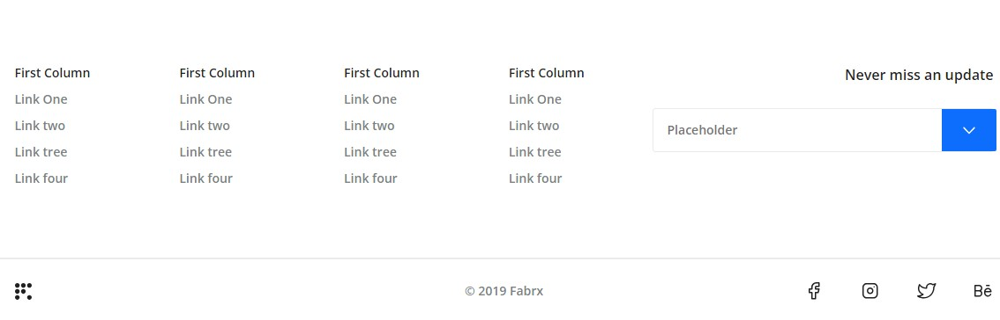

# Teknoloji Web Sitesi

Bu proje CSS öğrenirken yaptığım bir Teknoloji Web Sitesi projesidir


## Öğrendiklerim

Bu projeyi yaparken css grid kullanımını öğrendim

Divleri bir tık daha doğru kullanmayı düzgün isimlendirmeyi öğrendim

Footer Navbar gibi kısımları düzgün isimlendirmeyi ve semantik kod yazmayi öğrendim


  
## Bilgisayarınızda Çalıştırın

Projeyi klonlayın

```bash
  git clone https://github.com/remolg/Grid-Project.git
```

Proje dizinine gidin

```bash
  cd "Technology-Website"
```


  
## Ekran Görüntüleri



  